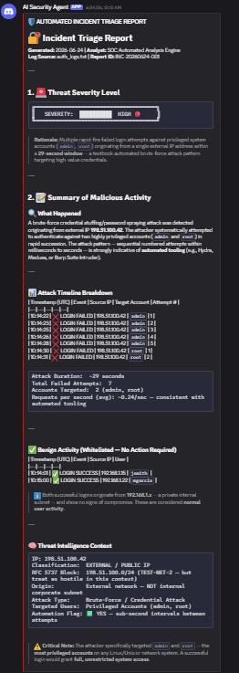

\# 🤖 AI-Driven Incident Responder (SIEM + SOAR Automation)


An automated SecOps agent that monitors authentication logs, leverages the \*\*Anthropic Claude API\*\* for real-time contextual threat analysis, and dispatches interactive incident alerts via \*\*Discord Webhooks\*\*. 


This repository serves as a proof-of-concept for modernizing Security Operations Centers (SOCs) using Large Language Models to reduce alert fatigue and accelerate triage times.


\---


\## 🏗️ System Architecture


\[ Local Auth Logs ] ──(Monitors)──> \[ Python Security Agent ]

│

(Enriches \& Analyzes)

▼

\[ Anthropic Claude API ]

│

(Evaluates Severity)

▼

\[ Discord Alert Channel ] <──(Dispatches)───  If Critical


1\. \*\*Log Ingestion:\*\* The Python core continuously reads raw text authentication files (`auth\_logs.txt`) looking for anomalies.

2\. \*\*AI Enrichment:\*\* Detected brute-force patterns or unusual failures are bundled and sent to Claude with tight operational constraints.

3\. \*\*Automated Alerting:\*\* If Claude classifies the activity as a validated high-severity threat, a rich markdown alert is compiled and pushed instantly to an operations Discord channel.


\---


\## ⚡ Features

> **Simulation Output:** Below is a live incident alert dispatched to Discord after Claude analyzed a brute-force attack signature in the authentication logs.



\*   \*\*Real-Time Log Parsing:\*\* Low-overhead scanning of standard Linux/Windows authentication structures.

\*   \*\*Zero-Shot Threat Classification:\*\* Eliminates strict regex rule-writing by allowing an LLM to accurately separate routine typos from coordinated credential stuffing attacks.

\*   \*\*Discord Integration:\*\* Delivers actionable, structured payloads to security engineers on mobile or desktop instantly.

\*   \*\*Hardened Security Architecture:\*\* Implements a decoupled `.env` system configuration to guarantee zero production key exposure during deployments.


\---


\## 🛠️ Tech Stack


\*   \*\*Language:\*\* Python 3.11+

\*   \*\*LLM Engine:\*\* Anthropic Client SDK (Claude 3.5 Sonnet / Haiku)

\*   \*\*Integrations:\*\* Discord Webhooks API

\*   \*\*Environment Management:\*\* Python-Dotenv


\---


\## 🚀 Quick Start \& Deployment


\### 1. Prerequisites

Ensure you have Git and Python 3 installed on your local environment.


\### 2. Clone \& Setup Environment

```bash

\# Clone the repository

git clone https://github.com/YOUR\_USERNAME/AI-Driven-Incident-Responder.git

cd AI-Driven-Incident-Responder


\# Create and activate virtual environment

python -m venv venv

\# On Windows Command Prompt:

venv\\Scripts\\activate.bat

```


\### 3. Install Dependencies

```bash

pip install -r requirements.txt

```


\### 4. Configure Secure Keys

Create a `.env` file in the root directory:

```env

ANTHROPIC\_API\_KEY=your\_actual\_anthropic\_key\_here

DISCORD\_WEBHOOK\_URL=your\_actual\_discord\_url\_here

```


\### 5. Execute Execution Test

Run the script to simulate log evaluation:

```bash

python security\_agent.py

```


\## 🔒 Security \& Git Discipline

This project employs strict environment decoupling. The local tracking logic utilizes a .gitignore framework ensuring that infrastructure secrets (`.env`) and local testing environments (`venv/`) remain completely abstracted from public version control.


